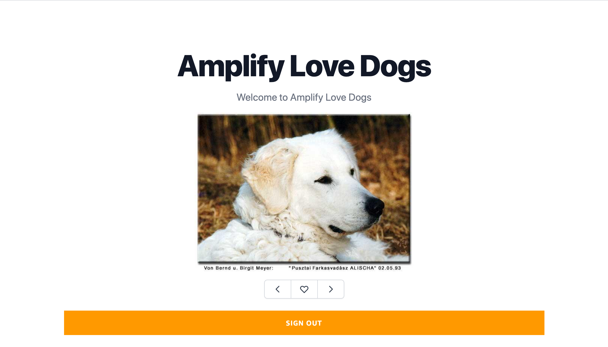
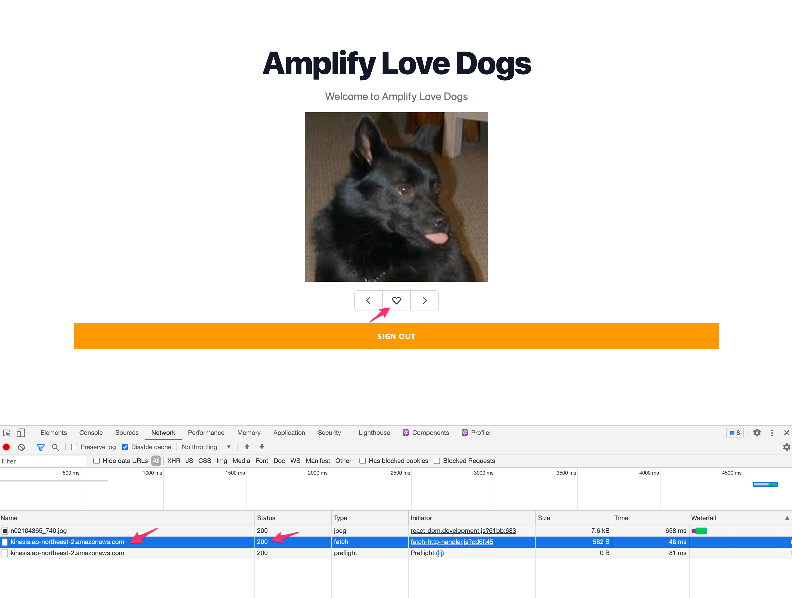
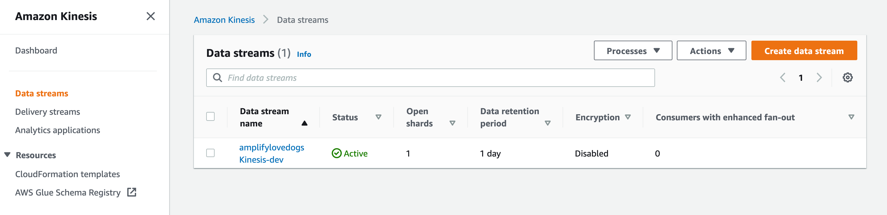
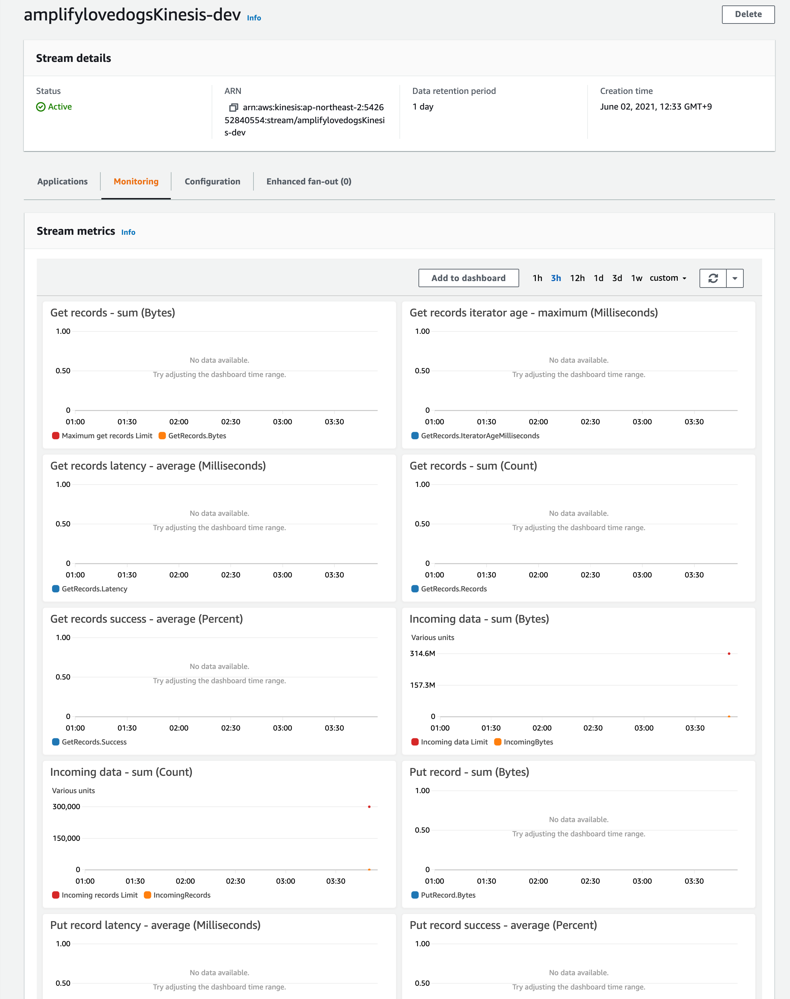

# Amplify Love Dogs

[한국어](README_ko.md)



This hands-on lab will build a full-stack serverless application on AWS using Amplify, Next.js.

This application will be similar to like-it-or-not for dogs.
It will show pictures of dogs and users will either like it or pass it.
Those events will then be sent to AWS Kinesis DataStream.

Data ingested into Kinesis DataStream can further be processed for various data related works (e.g. analytics, AI/ML)
Think of this application as a gateway for data analytics on AWS.

Once users follow this guide, they will have a working application running on AWS.

## Overview

We will create a new project using Create Next App.

We will then use Amplify CLI to set up AWS Cloud environment and use Amplify JS Libraries to connect our Next.js app to our back-end on AWS Cloud

This project will be a fully-serverless application with following architecture.

This hands-on lab is expected to be done in 1 to 2 hours

[Demo](https://dev.d2lf8ywg8xsqzo.amplifyapp.com)

### Required Background / Level

This guide has been made for front-end and back-end developers who want to learn more about building a data-driven full-stack serverless application on AWS.

Having knowledge in React is helpful, but not necessary.

### Topics we will cover

- Next.js application
- Web application Hosting
- Authentication
- Data Inestion into Kinesis DataStream
- Deleting the resources

### Features we will implement

1. Application hosting
2. Authentication : Sign Up, Login, Signout
3. Sending data to Kinesis DataStream
4. Application UI

### Development Environment

Before we start, please install

- Node.js v10.x or later
- npm v5.x or later
- git v2.14.1 or later

On a terminal, we will run Amplify CLI to create a infrastructure, start
Next.js application on a local machine, and test application on a
browser.

### AWS Account

If you don't have an AWS account and would like to create and activate an AWS account, please refer to the following
[link](https://aws.amazon.com/premiumsupport/knowledge-center/create-and-activate-aws-account/).

### Create a Next.js application

Let's create a new project using [Create Next App](https://nextjs.org/docs/api-reference/create-next-app)

```sh
$ npx create-next-app amplify-love-dogs
```

move into the `amplify-love-dogs` directory and install required packages.

```sh
$ cd amplify-love-dogs
$ yarn add aws-amplify @aws-amplify/ui-react lodash
```

### Styling with TailwindCSS

We will use TailwindCSS to style application.

Let's install TailwindCSS related packages in devDependencies.

```sh
$ yarn add --dev tailwindcss@latest postcss@latest autoprefixer@latest @tailwindcss/forms
```

To create Tailwind config files (`tailwind.config.js` `postcss.config.js`), let's run the following.

```sh
$ npx tailwindcss init -p
```

Now, let's update `tailwind.config.js` as following.

> This is to do tree-shake unused styling in production build

```diff
// tailwind.config.js
module.exports = {
-  purge: [],
+  purge: ['./pages/**/*.{js,ts,jsx,tsx}', './components/**/*.{js,ts,jsx,tsx}'],
  darkMode: false, // or 'media' or 'class'
  theme: {
    extend: {},
  },
  variants: {
    extend: {},
  },
-  plugins: [],
+. plugins: [require('@tailwindcss/forms')],
}
```

To use Tailwind's base, component, and utilities style, Let's update `./styles/globals.css`

```
/* ./styles/globals.css */
@tailwind base;
@tailwind components;
@tailwind utilities;
```

> If you would like to know more about installing TailwindCSS, plesae check [here](https://tailwindcss.com/docs/guides/nextjs)

### / root page

Let's update **pages/index.js**, which renders / root page.

```js
/* pages/index.js */
import Head from "next/head";

function Home() {
  return (
    <div>
      <Head>
        <title>Amplify Love Dogs</title>
        <link
          rel="icon"
          href="data:image/svg+xml,<svg xmlns=%22http://www.w3.org/2000/svg%22 viewBox=%220 0 100 100%22><text y=%22.9em%22 font-size=%2290%22>🐕</text></svg>"
        />
      </Head>

      <div className="container mx-auto">
        <main className="bg-white">
          <div className="px-4 py-16 mx-auto max-w-7xl sm:py-24 sm:px-6 lg:px-8">
            <div className="text-center">
              <p className="mt-1 text-4xl font-extrabold text-gray-900 sm:text-5xl sm:tracking-tight lg:text-6xl">
                Amplify Love Dogs
              </p>
              <p className="max-w-xl mx-auto mt-5 text-xl text-gray-500">
                Welcome to Amplify Love Dogs
              </p>
            </div>
          </div>
        </main>
      </div>

      <footer></footer>
    </div>
  );
}

export default Home;
```

Let's run `yarn dev` to start a local server, and check if the page
loads with no issues on a browser at localhost:3000

```sh
$ yarn dev
```

### Intializing a git repostory

Let's create a git repository for this project at (https://github.com/new)

Once you create a repository, let's initialize a git in your folder, and
add the created repository url.

```sh
$ git init
$ git remote add origin git@github.com:username/project-name.git
$ git add .
$ git commit -m 'initial commit'
$ git push origin main
```

## Install Amplify CLI & Initialize Amplify Project

### Install Amplify CLI

Let's install Amplify CLI

```sh
$ npm install -g @aws-amplify/cli
```

Now, let's configure CLI to use your AWS credential.

> If you would like to know more about the steps to create a credential,
> please check this video
> [here](https://www.youtube.com/watch?v=fWbM5DLh25U)

```sh
$ amplify configure

- Specify the AWS Region: ap-northeast-2
- Specify the username of the new IAM user: amplify-cli-user
> In the AWS Console, click Next: Permissions, Next: Tags, Next: Review, & Create User to create the new IAM user. Then return to the command line & press Enter.
- Enter the access key of the newly created user:
? accessKeyId: (<YOUR_ACCESS_KEY_ID>)
? secretAccessKey: (<YOUR_SECRET_ACCESS_KEY>)
- Profile Name: amplify-cli-user
```

### Initialzing Amplify Project

Let's initialze your Amplify project.

```sh
$ amplify init

- Enter a name for the project: amplifyforum
- Enter a name for the environment: dev
- Choose your default editor: Visual Studio Code (or your default editor)
- Please choose the type of app that youre building: javascript
- What javascript framework are you using: react
- Source Directory Path: src
- Distribution Directory Path: out
- Build Command: npm run-script build
- Start Command: npm run-script start
- Do you want to use an AWS profile? Y
- Please choose the profile you want to use: amplify-cli-user
```

> **You must change Distribution Directory Path to `out`.**
> After you build and export your Next.js, build artifacts will be
> placed in `out` directory

> Once `amplify init` is done, **amplify** folder will be created and `aws-exports.js` file will be created in **src** folder.

> **src/aws-exports.js** is where you will find Amplify config infos.

> **amplify/team-provider-info.json** contains variables for Amplify project's
> back-end environment.
> If you plan to share the same back-end environment, you should share
> this file. If not (e.g. opening this project to a public), you should
> not share this file (e.g. adding this file in `.gitignore`)

> For more info, please check (https://docs.amplify.aws/cli/teams/shared)

You can check Amplify project's status with `amplify status` command.

```sh
$ amplify status
```

If you want to check with Amplify console,`amplify console`
should launch a console in your browser.

```sh
$ amplify console
```

### Configuring the Next applicaion with Amplify

Once we have Amplify project ready, we now need to make our Next.js app
to be aware of Amplify project.
We can do this by making the top level component to configure Amplify with `src/aws-exports.js` file

Let's open **pages/\_app.js** and add the following.

```diff
  import '../styles/globals.css'
+ import Amplify from "aws-amplify";
+ import config from "../src/aws-exports";
+ Amplify.configure(config);

  function MyApp({ Component, pageProps }) {
    return <Component {...pageProps} />
  }

  export default MyApp
```

Once it's done, our Next.app is ready to use AWS managed by Amplify.

## Hosting

Amplify Console takes care of application hosting as well as CI and deployment.

First, let's update **package.json** as follows.

```diff
"scripts": {
  "dev": "next dev",
-  "build": "next build",
+  "build": "next build && next export",
  "start": "next start"
},
```

> `next export` generates static HTML from the Next.js app so the
> application can be served as a static file without the need of a Node
> server.

> As of 2021-04, Amplify hosting can only serve static files. However,
> server-side rending will soon be supported.

To add hosting, let's run `amplify add hosting`

```sh
$ amplify add hosting

? Select the plugin module to execute: Hosting with Amplify Console (Managed hosting with custom domains, Continuous deployment)
? Choose a type: Manual deployment
```

To apply the change we just made, let's run `amplify push`

```sh
$ amplify push
```

To publish/deploy our application, run `amplify publish`

```sh
$ amplify publish
```

Once deployment is finished, a url will be printed. Go to the url in
your browser, and make sure your application loads correctly.

## Adding Authentication

Let's now add authentication.

To add authentication feature, run `amplify add auth`

```sh
$ amplify add auth

? Do you want to use default authentication and security configuration? Default configuration
? How do you want users to be able to sign in when using your Cognito User Pool? Username
? Do you want to configure advanced settings? No, I am done.
```

To apply the change, run `amplify push`

```sh
$ amplify push

? Are you sure you want to continue? Yes
```

### withAuthenticator

Using `withAuthencator` HOC provided by amplify-ui, we can make sure
pages are protected by authentication.

Once applied, users must log in to access the page. If not, they will be
redirected to a login page.

This UX flow is all taken care of by `withAuthenticator`

To test, let's update **/pages/index.js**

```diff
/* pages/index.js */
import Head from "next/head";
+ import { withAuthenticator } from "@aws-amplify/ui-react";

- export default Home;
+ export default withAuthenticator(Home);
```

> Authenticator UI Component document [here](https://docs.amplify.aws/ui/auth/authenticator/q/framework/react)

Let's start a dev server and test in the browser.

```sh
yarn dev
```

If you try to load a root / page, you will be redirected to a login.

Let's create a new account with sign-up.

Once signed up, you will receive a confirmation code in your email.

Entering the confirmation code will complete the new user sign up.

You can check newly created users in Auth console

```sh
$ amplify console auth

> Choose User Pool
```

### Signout

Let's add signout by using Signout UI component.

Add `AmplifySignout` compoent somewhere in your page component. (e.g.
pages/index.js)

```js
import { withAuthenticator, AmplifySignOut } from "@aws-amplify/ui-react";

/* UI 어딘가에 넣어주세요. */
<AmplifySignOut />;
```

> Sign Out UI Component doc [here](https://docs.amplify.aws/ui/auth/sign-out/q/framework/react)

Let's click on signout button, and make sure you can logout
successfully.

### Accessing User Data

When logged in, you can access authenticated user's information with `Auth.currentAuthenticatedUser()`

Let's update **pages/index.js** to print user information in console.

```diff
+ import { useEffect } from "react";
+ import { Auth } from "aws-amplify";

function Home() {
+ useEffect(() => {
+ checkUser(); // new function call
+ }, []);
+
+ async function checkUser() {
+   const user = await Auth.currentAuthenticatedUser();
+   console.log("user: ", user);
+   console.log("user attributes: ", user.attributes);
+ }

  /* 이전과 동일 */
}


```

Once you load the page with browser console opened, you will see the
authenticated user's information and attributes in the console.

## Prepare data to show in UI

We need to fetch data. We will create files that contain (1) breed names (2) images for breeds

### Breed list

Create a file in **src/breeds.js** and fill with following

```javascript
const BREEDS = {
  affenpinscher: [],
  african: [],
  airedale: [],
  akita: [],
  appenzeller: [],
  australian: ["shepherd"],
  basenji: [],
  beagle: [],
  bluetick: [],
  borzoi: [],
  bouvier: [],
  boxer: [],
  brabancon: [],
  briard: [],
  buhund: ["norwegian"],
  bulldog: ["boston", "english", "french"],
  bullterrier: ["staffordshire"],
  cairn: [],
  cattledog: ["australian"],
  chihuahua: [],
  chow: [],
  clumber: [],
  cockapoo: [],
  collie: ["border"],
  coonhound: [],
  corgi: ["cardigan"],
  cotondetulear: [],
  dachshund: [],
  dalmatian: [],
  dane: ["great"],
  deerhound: ["scottish"],
  dhole: [],
  dingo: [],
  doberman: [],
  elkhound: ["norwegian"],
  entlebucher: [],
  eskimo: [],
  finnish: ["lapphund"],
  frise: ["bichon"],
  germanshepherd: [],
  greyhound: ["italian"],
  groenendael: [],
  havanese: [],
  hound: ["afghan", "basset", "blood", "english", "ibizan", "plott", "walker"],
  husky: [],
  keeshond: [],
  kelpie: [],
  komondor: [],
  kuvasz: [],
  labradoodle: [],
  labrador: [],
  leonberg: [],
  lhasa: [],
  malamute: [],
  malinois: [],
  maltese: [],
  mastiff: ["bull", "english", "tibetan"],
  mexicanhairless: [],
  mix: [],
  mountain: ["bernese", "swiss"],
  newfoundland: [],
  otterhound: [],
  ovcharka: ["caucasian"],
  papillon: [],
  pekinese: [],
  pembroke: [],
  pinscher: ["miniature"],
  pitbull: [],
  pointer: ["german", "germanlonghair"],
  pomeranian: [],
  poodle: ["miniature", "standard", "toy"],
  pug: [],
  puggle: [],
  pyrenees: [],
  redbone: [],
  retriever: ["chesapeake", "curly", "flatcoated", "golden"],
  ridgeback: ["rhodesian"],
  rottweiler: [],
  saluki: [],
  samoyed: [],
  schipperke: [],
  schnauzer: ["giant", "miniature"],
  setter: ["english", "gordon", "irish"],
  sheepdog: ["english", "shetland"],
  shiba: [],
  shihtzu: [],
  spaniel: [
    "blenheim",
    "brittany",
    "cocker",
    "irish",
    "japanese",
    "sussex",
    "welsh",
  ],
  springer: ["english"],
  stbernard: [],
  terrier: [
    "american",
    "australian",
    "bedlington",
    "border",
    "dandie",
    "fox",
    "irish",
    "kerryblue",
    "lakeland",
    "norfolk",
    "norwich",
    "patterdale",
    "russell",
    "scottish",
    "sealyham",
    "silky",
    "tibetan",
    "toy",
    "westhighland",
    "wheaten",
    "yorkshire",
  ],
  vizsla: [],
  waterdog: ["spanish"],
  weimaraner: [],
  whippet: [],
  wolfhound: ["irish"],
};

export default BREEDS;
```

### Images for breeds

Download [this file](breed-image-url.json) as **breed-image-url.json**

## Implementing UI

Let's install additional packages for UI in devDependencies.

```sh
$ yarn add --dev @headlessui/react @heroicons/react
```

Let's update **pages/index.js** as follows.

```javascript
import Head from "next/head";
import { useEffect, useState } from "react";
import _ from "lodash";
import BREEDS from "../src/breeds";
import fs from "fs";
import {
  HeartIcon,
  ChevronLeftIcon,
  ChevronRightIcon,
} from "@heroicons/react/outline";
import { withAuthenticator, AmplifySignOut } from "@aws-amplify/ui-react";
import { Auth } from "aws-amplify";
import { Analytics } from "aws-amplify";

async function fetchBreeds() {
  return [...Object.keys(BREEDS)];
}

async function fetchBreedImageUrls(mainBreed) {
  const data = fs.readFileSync("breed-image-url.json");
  const imageUrls = JSON.parse(data);
  return imageUrls;
}

export async function getStaticProps(context) {
  const breeds = await fetchBreeds();
  const breedImageUrls = await fetchBreedImageUrls();

  return {
    props: { initialBreeds: breeds, initialBreedsUrls: breedImageUrls },
  };
}

function DogCard({ imageUrl, onNext, onPrev, onLike }) {
  return (
    <>
      <div className="max-w-screen-lg mx-auto h-80">
        
      </div>
      <div className="mt-4">
        <span className="relative z-0 inline-flex rounded-md shadow-sm">
          <button
            onClick={onPrev}
            type="button"
            className="relative inline-flex items-center px-4 py-2 text-sm font-medium text-gray-700 bg-white border border-gray-300 rounded-l-md hover:bg-gray-50 focus:z-10 focus:outline-none focus:ring-1 focus:ring-indigo-500 focus:border-indigo-500"
          >
            <ChevronLeftIcon className="w-5 h-5" aria-hidden="true" />
          </button>
          <button
            onClick={onLike}
            type="button"
            className="relative inline-flex items-center px-4 py-2 -ml-px text-sm font-medium text-gray-700 bg-white border border-gray-300 hover:bg-gray-50 focus:z-10 focus:outline-none focus:ring-1 focus:ring-indigo-500 focus:border-indigo-500"
          >
            <HeartIcon className="w-5 h-5" aria-hidden="true" />
          </button>
          <button
            onClick={onNext}
            type="button"
            className="relative inline-flex items-center px-4 py-2 -ml-px text-sm font-medium text-gray-700 bg-white border border-gray-300 rounded-r-md hover:bg-gray-50 focus:z-10 focus:outline-none focus:ring-1 focus:ring-indigo-500 focus:border-indigo-500"
          >
            <ChevronRightIcon className="w-5 h-5" aria-hidden="true" />
          </button>
        </span>
      </div>
    </>
  );
}

function Home({ initialBreeds, initialBreedsUrls }) {
  const [breeds, setBreeds] = useState(initialBreeds);
  const [breedsUrls, setBreedsUrls] = useState(initialBreedsUrls);
  const [randomBreed, setRandomBreed] = useState();
  const [randomBreedUrl, setRandomBreedUrl] = useState();
  const [currentUser, setCurrentUser] = useState();

  useEffect(() => {
    console.log("breeds = ", breeds);
    checkUser();
  }, []);

  async function checkUser() {
    const user = await Auth.currentAuthenticatedUser();
    console.log("user: ", user);
    console.log("user attributes: ", user.attributes);
    setCurrentUser(user);
  }

  useEffect(() => {
    setRandomBreed(_.sample(breeds));
  }, [breeds]);

  useEffect(() => {
    console.log("breed = ", randomBreed);
    const urls = breedsUrls[randomBreed];
    setRandomBreedUrl(_.sample(urls));
  }, [randomBreed]);

  const handleLike = () => {
    setRandomBreed(_.sample(breeds));
  };

  const handlePrev = () => {
    setRandomBreed(_.sample(breeds));
  };

  const handleNext = () => {
    setRandomBreed(_.sample(breeds));
  };

  return (
    <div>
      <Head>
        <title>Amplify Love Dogs</title>
        <link
          rel="icon"
          href="data:image/svg+xml,<svg xmlns=%22http://www.w3.org/2000/svg%22 viewBox=%220 0 100 100%22><text y=%22.9em%22 font-size=%2290%22>🐕</text></svg>"
        />
      </Head>

      <div className="container mx-auto">
        <main className="bg-white">
          <div className="px-4 py-16 mx-auto max-w-7xl sm:py-24 sm:px-6 lg:px-8">
            <div className="text-center">
              <p className="mt-1 text-4xl font-extrabold text-gray-900 sm:text-5xl sm:tracking-tight lg:text-6xl">
                Amplify Love Dogs
              </p>
              <p className="max-w-xl mx-auto mt-5 text-xl text-gray-500">
                Welcome to Amplify Love Dogs
              </p>
              <div className="mt-4">
                {randomBreed && randomBreedUrl && (
                  <DogCard
                    breed={randomBreed}
                    imageUrl={randomBreedUrl}
                    onLike={handleLike}
                    onPrev={handlePrev}
                    onNext={handleNext}
                  />
                )}
              </div>
            </div>
            <div className="mt-6">
              <AmplifySignOut />
            </div>
          </div>
        </main>
      </div>

      <footer></footer>
    </div>
  );
}

export default withAuthenticator(Home);
```

## Sending data from application

Let's create data endpoint where application will send data to. In this guide, we will set up a Kinesis DataStream.

### Set up Kinesis DataStream

Let's create a Kinesis DataStream endpoint with Amplify cli

```sh
$ amplify add analytics

? Select an Analytics provider : Amazon Kinesis Streams
? Enter a Stream name : amplifylovedogsKinesis
? Enter number of shards : 1
? Apps need authorization to send analytics events. Do you want to allow guests and unauthenticated users to send analytics events? (we recommend you allow this when getting started) : Yes

```

To apply the change we just made, run `amplify push --y`

```sh
$ amplify push --y
```

### Configure application for Kinesis DataStream

Update **\_app.js** file.

```diff
import config from "../src/aws-exports";
+ import { Analytics, AWSKinesisProvider } from "aws-amplify";

Amplify.configure(config);
+ Analytics.addPluggable(new AWSKinesisProvider());
+ Analytics.configure({
+   AWSKinesis: {
+     region: config.aws_project_region,
+  },
+ });

```

### Send events to Kinesis

Let's update **pages/index.js** to send user events to Kinesis

```diff
import { Auth } from "aws-amplify";
+ import { Analytics } from "aws-amplify";

/* same as before */

function Home({ initialBreeds, initialBreedsUrls }) {
  /* same as before */
  const handleLike = () => {
+    recordUserActivity("like");
    setRandomBreed(_.sample(breeds));
  };

  const handlePrev = () => {
+    recordUserActivity("prev");
    setRandomBreed(_.sample(breeds));
  };

  const handleNext = () => {
+    recordUserActivity("next");
    setRandomBreed(_.sample(breeds));
  };

+  const recordUserActivity = (action) => {
+    const userActivity = {
+      username: currentUser.username,
+      action,
+      breed: randomBreed,
+    };
+    console.log(userActivity);
+    Analytics.record(
+      {
+        data: { userActivity },
+        streamName: "amplifylovedogsKinesis-dev" // TODO: Set to Kinesis Stream Name, and it has to include environment name too, e.g.: 'traveldealsKinesis-dev'
+      },
+      "AWSKinesis"
+    );
+  };
}
```

### Test events

In the browser, do some action. (e.g. like a dog) and see if events get sent to the Kinesis without any issues.



### Review Kinesis DataStream

Let's open up [Kinesis Console](https://console.aws.amazon.com/kinesis/) and see if data has been recieved.

Click on `Data Streams` and select the stream that we created (e.g. `amplifylovedogsKinesis-dev`)



Check `Monitoring` tab to see if there are any changes in Incoming data and put records



## Additional Tests + TODO's

## Removing resources

If you want to remove one of the services you added with Amplify CLI, you can run `amplify remove`

For example, `amplify remove auth` will remove authentication feature.

```sh
$ amplify remove auth

$ amplify push
```

If you are not sure about which services you have enabled, you can check with `amplify status`

```sh
$ amplify status
```

### Deleting the Amplify project and all services

If you want to delete Amplify project completely, run `amplify delete`

```sh
$ amplify delete
```
